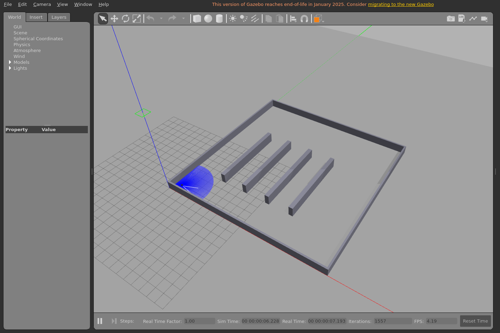
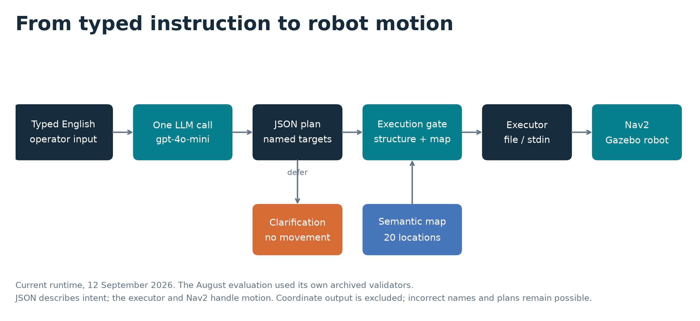
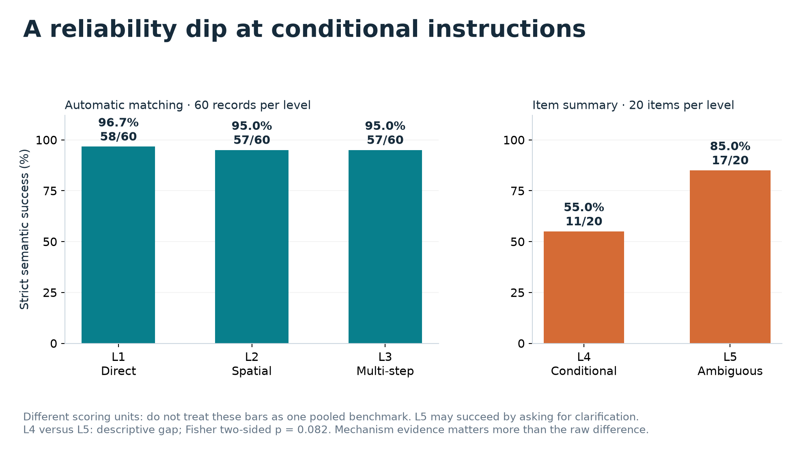
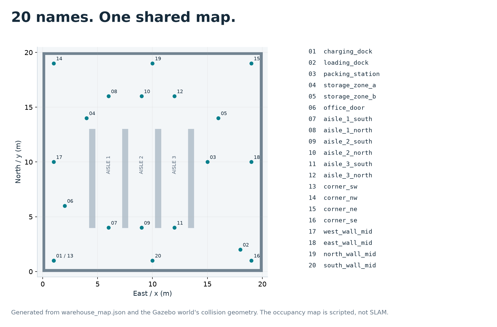
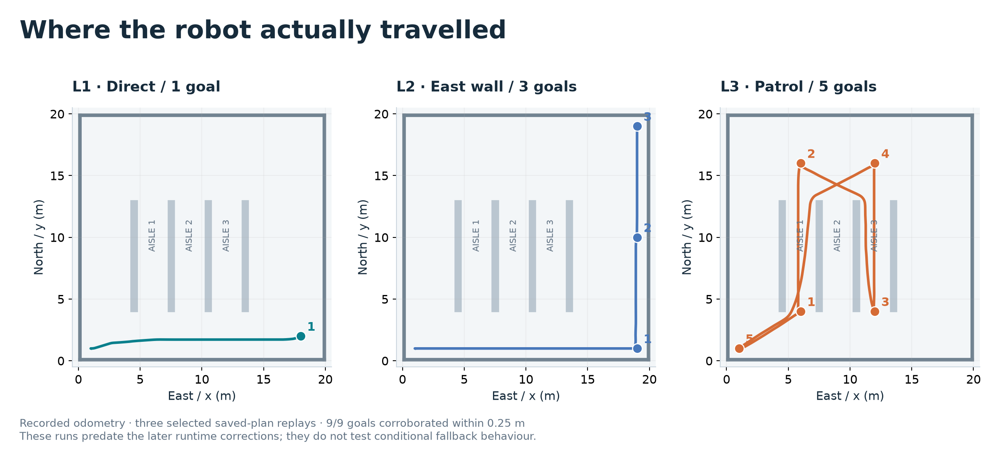
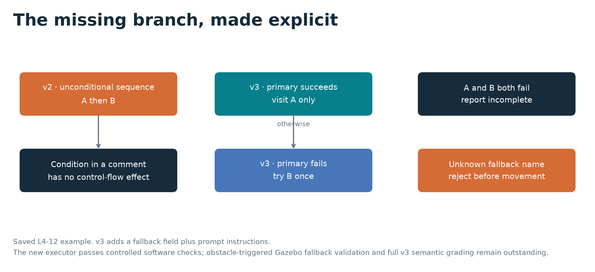
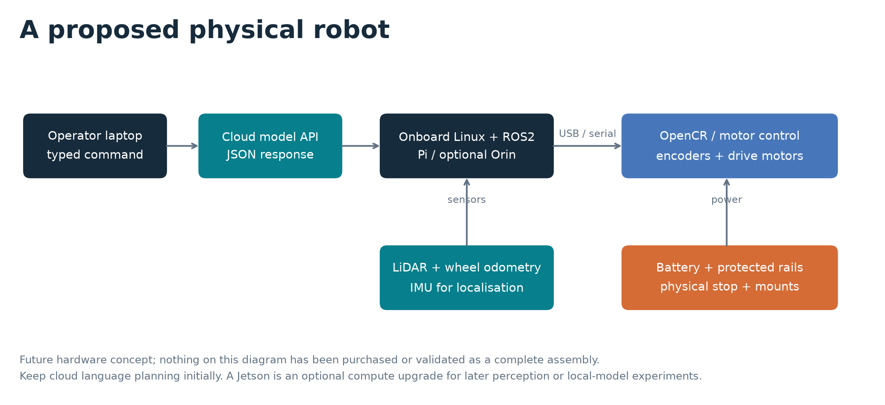

# Natural language → robot navigation

**A reproducible study of typed instructions, structured plans and warehouse navigation.**

William · MSc Robotics · Middlesex University Dubai · PDE4445

[Visual portfolio](https://twillur.github.io/PDE4445-LLM-Nav2-Planner/) · [Media library](docs/portfolio/MEDIA.md) · [Evidence guide](docs/portfolio/EVIDENCE.md) · [Project journal](https://twillur.github.io/PDE4445-Robotics-Dissertation/)

*Actual warehouse simulation, captured 12 September 2026. [Watch/download the navigation clip](docs/portfolio/media/warehouse-navigation.mp4) · [Inspect the goal log](docs/portfolio/media/navigation-log.txt). The clip is time-compressed, not real-time playback.*

## The research question

An operator types an English instruction. One gpt-4o-mini call translates it into a JSON plan of named locations. An executor sends navigation goals to Nav2, which drives a TurtleBot3 Waffle through a Gazebo warehouse.

The project measures **how reliably that translation holds as instructions change**, rather than stopping at a working demonstration. Saved conditional failures identify a limit in what the original plan format can express. A targeted v3 fallback feature improves schema adherence and selected branch encoding; it does not establish complete semantic correctness.

| Scope | Design |
|---|---|
| Input | Typed English; voice is future work |
| Planner | One model call, temperature 0, JSON-object mode; no agent loop or re-prompting |
| Map | 20 named locations in a scripted 20 × 20 m warehouse |
| Robot | TurtleBot3 Waffle, ROS2 Humble, Gazebo Classic 11, Nav2 |
| Localisation | Ground-truth odometry, map server and static map→odom transform; not SLAM Toolbox |
| Evaluation | 100 authored commands; 20 per category; v1/v2 each generated over three trials |
| Limits | Simulation and navigation only; no manipulation, physical inspection or hardware results |

## Explore the project visually

| System and map | Results and execution |
|---|---|
|  |  |
|  |  |

Every figure is available as **PNG, SVG and PDF**. The [interactive portfolio](https://twillur.github.io/PDE4445-LLM-Nav2-Planner/) adds route selection, playback and a filterable download gallery.

To view it locally:

~~~bash
python -m http.server 8765 --bind 127.0.0.1
# Open http://127.0.0.1:8765/docs/portfolio/
~~~

The [public portfolio](https://twillur.github.io/PDE4445-LLM-Nav2-Planner/) is hosted on GitHub Pages. To publish a later revision, push the reviewed changes and manually run **Publish research portfolio (manual)** in the repository's Actions tab.

## Five instruction categories

| Category | Example | What it probes |
|---|---|---|
| L1 · Direct | “Go to the loading dock” | A named destination |
| L2 · Spatial | “Move along the east wall from south to north” | Spatial relations and ordering |
| L3 · Multi-step | “Patrol aisles 1 and 3, then return to the charging dock” | A sequence of destinations |
| L4 · Conditional | “Inspect A; if it is unreachable, inspect B instead” | A branch in the plan |
| L5 · Ambiguous | “Go check that thing near the door” | Whether clarification is needed |

Examples illustrate the categories. This authored scale is not a validated universal measure of language complexity. See the [dataset](dataset/commands.json) for all commands and expected answers.

## What the archived results support

| Level | Strict success | Scoring unit | With half-credit for partial |
|---|---:|---|---:|
| L1 | 96.7% | 58/60 generated records | — |
| L2 | 95.0% | 57/60 generated records | — |
| L3 | 95.0% | 57/60 generated records | — |
| L4 | 55.0% | 11/20 command items | 70.0% |
| L5 | 85.0% | 17/20 command items | 92.5% |

**Keep the denominators visible.** L1–L3 use automatic matching across three trials. L4/L5 item summaries use first-generation judgements, with manual grading where required.

L5 can succeed by asking a question. The original L4 contract lacks an alternative-destination branch, even for clear instructions. The L4/L5 descriptive gap alone is not significant at 0.05 (two-sided Fisher p≈0.082). Inspected failures and the targeted intervention support a bounded claim: **plan representation is one limiting factor in translation reliability**.

- v1→v2 on L1–L3: **153/180 → 172/180** automatic passes; seven commands improved, none regressed.
- v2 validity: parse **300/300**, schema **295/300**, ordinary-target map checking **295/295** among responses reaching that check.
- v3 L4 schema adherence: **60/60**, versus v2 **55/60**. Selected branch diagnostic: **7/9**, versus **0/9**; full semantic grading remains incomplete.
- v2 planner-call latency: **mean 2.23 s, median 2.08 s, p95 3.63 s**, n=300; exclusive-quantile p95.

[Evidence and limitations](docs/portfolio/EVIDENCE.md) · [Prompt comparison](docs/portfolio/assets/prompt-comparison.pdf) · [Latency plot](docs/portfolio/assets/latency.pdf)

## From an encoded branch to execution

The **current runtime**, corrected on 12 September, validates the entire plan before movement, including unused fallback names. It implements goto_fallback only after primary-goal failure and reports failure for incomplete execution. Historical evaluation schemas and scores remain unchanged.

| Validation stage | Verified outcome | Limit |
|---|---|---|
| Three selected Gazebo replays | 1/1 + 3/3 + 5/5 goals; odometry within 0.25 m | Pre-fix executor; one run per case; no fallback trials |
| Runtime regression suite | **62 tests pass** in Windows and WSL | Software tests, including mocked ROS transport |
| Corrected-runtime filmed run | Loading dock **1/1**, reported by Nav2 | Visual demonstration; no new odometry bag |
| v3 primary/fallback cases | Primary-only, fallback after failure, and both-fail status checked | Controlled software responses, not physical obstacles |

[Validation records](docs/validation/README.md) · [Runtime corrections and preserved originals](docs/validation/runtime-fixes-20260912/README.md)

The saved v2 L4-12 plan still visits B unconditionally. Structural validation cannot repair a semantically wrong plan. Other limits include one model/map/grader, prompt/test overlap, uncertain grading blinding and incomplete v3 semantic grading. No general safety or deployment claim is made.

## Run a saved plan without ROS or an API key

Install pytest and jsonschema in your Python environment, then:

~~~bash
python -m pytest ros2_ws/src/nl_nav2_executor/test -q

python ros2_ws/src/nl_nav2_executor/scripts/dry_run.py \
  --plan docs/validation/execution-check-20260911T172852Z/v3-L4-12-trial0.json \
  --blocked storage_zone_a
~~~

The fallback case should visit storage_zone_b. Without the blocked location it visits only A. Blocking both A and B gives incomplete execution and exit code 1.

For WSL setup, simulation commands, software versions and plugins, use the [reproduction guide](docs/portfolio/reproduce.html). The script setup/verify-runtime-fixes.sh rebuilds the package and checks installed runtime resources.

## Proposed physical hardware

The [hardware study](docs/portfolio/hardware.html) includes four attributed supplier screenshots, a [dated USD/AED component table](docs/portfolio/hardware-costs.csv), two platform budgets, sensor/controller roles and power/software integration checks. **These are future options, not purchased or tested equipment.** The API-based planner does not require an onboard GPU; Orin compute is optional.

## Repository guide

| Location | Contents |
|---|---|
| [docs/portfolio/](docs/portfolio/) | Visual portfolio, media, hardware study and reproduction guide |
| [docs/validation/](docs/validation/) | Dated checks, source hashes, trajectories and pre-fix runtime snapshots |
| [dataset/](dataset/) · [results/](results/) | Commands, archived outputs and grading artifacts |
| [prompts/](prompts/) · [schema/](schema/) | Historical prompt and evaluation-contract versions |
| [src/](src/) | Planner, evaluation runner and current typed-command bridge |
| [ROS package](ros2_ws/src/nl_nav2_executor/) | Executor, runtime contract, Nav2 configuration, world and tests |
| [setup/](setup/) | Environment, verification, capture and reproducible figure/page tools |

**Report status:** the eight-page report is under assessment and is not published here. It will be added after the module result is released. Keep the [media provenance](docs/portfolio/MEDIA.md) with reused figures and vendor images.

Formal title: *Natural Language Task Planning for Autonomous Ground Robot Navigation via Large Language Models.*
